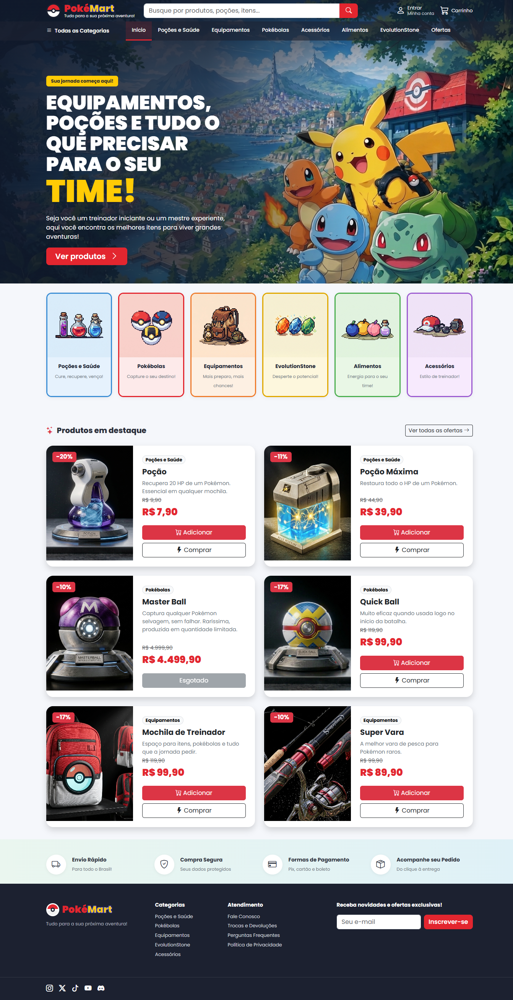
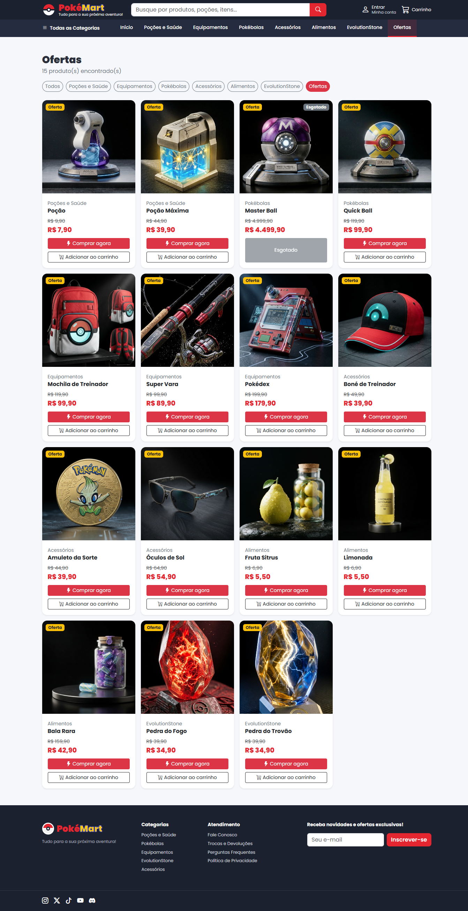
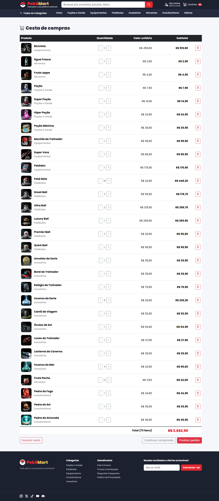
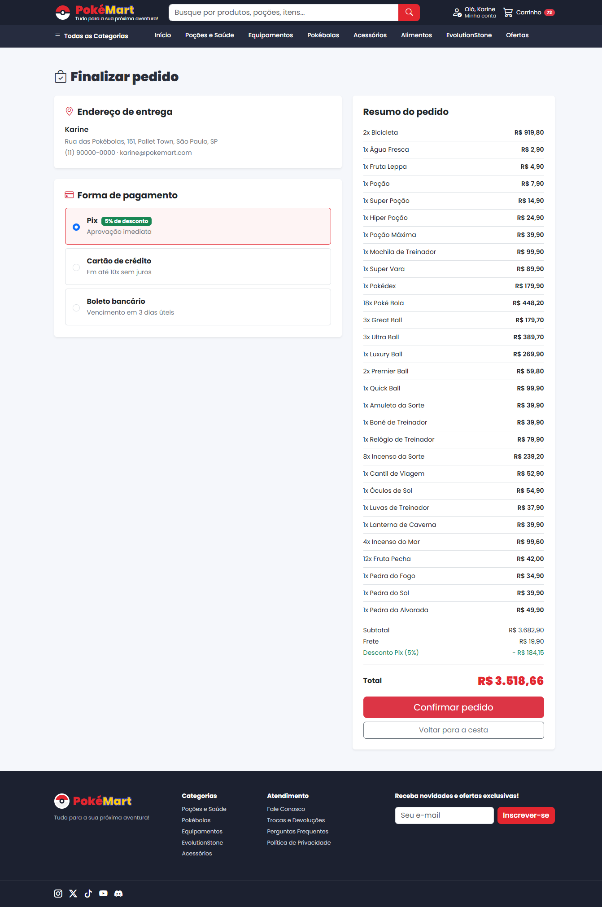
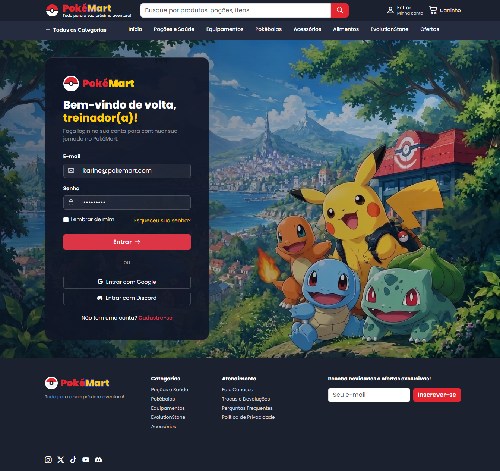
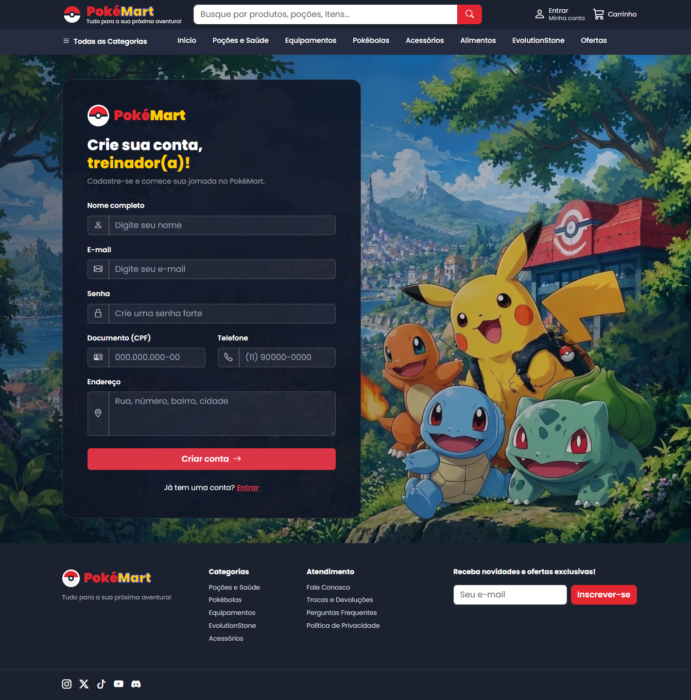

# PokéMart

Loja virtual fictícia de itens do universo Pokémon, desenvolvida como projeto de front end.



O projeto simula uma experiência completa de e-commerce: catálogo com filtro por categoria, busca, página de detalhe do produto, carrinho de compras, finalização de pedido, histórico de compras e telas de login e cadastro com validação de formulário.

## Tecnologias

- **Angular 22** com componentes standalone
- **TypeScript**
- **HTML5** com tags semânticas
- **CSS3** com variáveis para o tema da loja
- **Bootstrap 5.3** para grid, componentes e responsividade
- **Bootstrap Icons**
- **localStorage** para persistir usuários, carrinho e pedidos

## Funcionalidades

**Catálogo**
- 62 produtos divididos em 6 categorias
- Filtro por categoria pelo menu, pelos cards da home e pelos botões da vitrine
- Categoria especial "Ofertas", que reúne os produtos em promoção
- Busca por nome do produto em página própria de resultados
- Selos de oferta e de produto esgotado
- Preço original riscado ao lado do preço promocional

**Produto**
- Página de detalhe com descrição, estoque e cálculo da economia
- Seleção de quantidade
- Botão de compra desabilitado quando o produto está sem estoque

**Compra**
- Carrinho com alteração de quantidade, remoção de itens e cálculo de subtotal e total
- Contador de itens no ícone do carrinho
- Finalização com escolha de forma de pagamento e desconto automático de 5% no Pix
- Geração de número do pedido e tela de confirmação
- Histórico de pedidos do usuário logado

**Conta**
- Cadastro com validação de nome, e-mail, senha forte, documento, telefone e endereço
- Login com validação dos campos
- Recuperação de senha
- Menu de conta no cabeçalho com acesso aos pedidos e opção de sair

**Layout**
- Responsivo, adaptando a grade de produtos e o menu conforme o tamanho da tela
- Menu em formato hambúrguer em telas pequenas
- Cabeçalho transparente sobre o banner na página inicial

## Telas

### Página inicial


### Vitrine com filtro por categoria


### Carrinho


### Finalização do pedido


### Login


### Cadastro


## Estrutura do projeto

```
src/app/
├── components/     partes reaproveitadas em várias páginas
│   ├── header/
│   ├── hero/
│   ├── categorias/
│   ├── destaques/
│   ├── beneficios/
│   └── footer/
├── models/         classes e dados
│   ├── produto.ts
│   ├── lista-produtos.ts
│   ├── item-cesta.ts
│   └── cesta.ts
├── pages/          telas da loja
│   ├── home/
│   ├── vitrine/
│   ├── resulta-busca/
│   ├── detalhe/
│   ├── carrinho/
│   ├── pedido/
│   ├── meus-pedidos/
│   ├── login/
│   ├── cadastro/
│   └── recuperar-senha/
└── app.routes.ts   rotas da aplicação
```

As imagens dos produtos ficam em `public/imagens/produtos/` e são nomeadas pelo código do produto, então o produto de código 1 usa o arquivo `1.jpg`.

## Como rodar

Pré-requisito: [Node.js](https://nodejs.org) na versão LTS.

```bash
git clone https://github.com/KarineF-dev/pokemart.git
cd pokemart
npm install
npm start
```

Depois é só abrir `http://localhost:4200` no navegador.

## Observações

Este é um projeto acadêmico, sem back end. Os dados dos produtos ficam em um arquivo TypeScript e as informações de usuário, carrinho e pedidos são gravadas no localStorage do navegador. Em uma aplicação real, esses dados viriam de uma API e as senhas seriam armazenadas de forma criptografada no servidor.

Pokémon e seus personagens são marcas registradas da Nintendo, Game Freak e The Pokémon Company. Este projeto não tem fins comerciais e foi feito apenas para fins de estudo.
